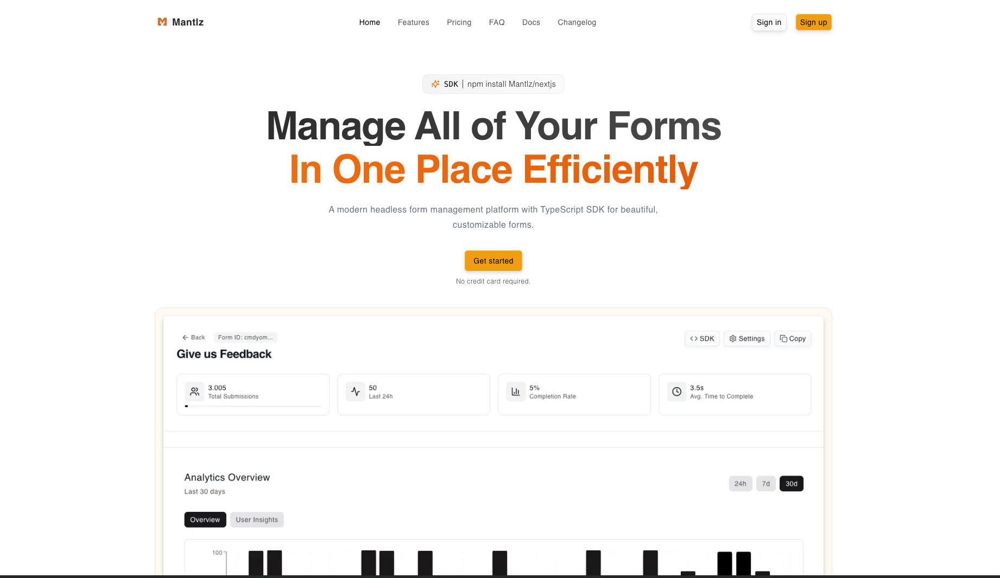

<div align="center">
  <h1>Mantlz</h1>
  
  🎉 **Now Open Source!** 🎉
  
  A modern headless form management platform that enables developers to create beautiful, customizable forms with a powerful dashboard and TypeScript-native SDK. Built with Next.js and designed for modern web applications.
  
  <p align="center">
    <a href="https://www.gnu.org/licenses/agpl-3.0">
      
    </a>
    <a href="https://github.com/artistatbl/Mantlz">
      
    </a>
  </p>
  
  <p align="center">
    <a href="https://www.typescriptlang.org/">
      
    </a>
    <a href="https://nextjs.org/">
      
    </a>
    <a href="https://reactjs.org/">
      
    </a>
    <a href="https://turbo.build/repo">
      
    </a>
    <a href="https://bun.sh/">
      
    </a>
    <a href="https://tailwindcss.com/">
      
    </a>
  </p>
  
  <!-- <p align="center">
    <a href="https://github.com/artistatbl/Mantlz/stargazers">
      
    </a>
    <a href="https://github.com/artistatbl/Mantlz/issues">
      
    </a>
    <a href="https://github.com/artistatbl/Mantlz/pulls">
      
    </a>
  </p> -->
  
  <p align="center">
    <a href="https://coderabbit.ai">
      
    </a>
    <a href="https://github.com/artistatbl/Mantlz/actions">
      
    </a>
    <a href="https://github.com/artistatbl/Mantlz">
      
    </a>
    <a href="https://github.com/artistatbl/Mantlz">
      
    </a>
    <a href="https://github.com/artistatbl/Mantlz">
      
    </a>
  </p>
  
  
</div>

## Project Overview

Mantlz consists of two main components:

1. **Main Application** - A Next.js dashboard for form management, analytics, and configuration
2. **SDK Library (`@mantlz/nextjs`)** - A TypeScript-native React component library for embedding forms

## Features

### Dashboard Features
- **Form Builder**: Visual form builder with drag-and-drop interface
- **Analytics Dashboard**: Real-time form submission analytics and insights
- **User Management**: Authentication and user management with Clerk
- **Billing Integration**: Stripe-powered subscription management
- **Campaign Management**: Email campaigns and automation
- **API Management**: RESTful API for form submissions and data

### SDK Features
- **Multiple Form Types**: Waitlist, contact, feedback, survey, application, order, and custom forms
- **Built-in Themes**: Default, modern, neobrutalism, and simple themes
- **Dark Mode Support**: Automatic dark mode detection with manual override
- **TypeScript Native**: Full TypeScript support with Zod validation
- **Customizable Appearance**: Extensive styling and theming options
- **File Uploads**: Support for file attachments with validation

## Getting Started

### Platform Setup

1. Clone the repository
2. Install dependencies: `npm install`
3. Set up environment variables (see `.env.example`)
4. Run the development server: `npm run dev`

### Using the SDK

Install the Mantlz SDK in your project:

```bash
npm install @mantlz/nextjs
```

Wrap your application with the `MantlzProvider`:

```tsx
import { MantlzProvider } from "@mantlz/nextjs";

export default function App({ children }) {
  return (
    <MantlzProvider apiKey="your-mantlz-api-key">
      {children}
    </MantlzProvider>
  );
}
```

## Using the Mantlz Component

The SDK provides a single `Mantlz` component that can render different form types based on your dashboard configuration:

### Basic Usage

```tsx
import { Mantlz } from "@mantlz/nextjs";

export default function MyForm() {
  return (
    <div className="container mx-auto p-4">
      <Mantlz formId="your-form-id" />
    </div>
  );
}
```

### With Custom Theme

```tsx
import { Mantlz } from "@mantlz/nextjs";

export default function ThemedForm() {
  return (
    <Mantlz 
      formId="your-form-id"
      theme="neobrutalism"
    />
  );
}
```

### Waitlist Form with User Count

```tsx
import { Mantlz } from "@mantlz/nextjs";

export default function WaitlistPage() {
  return (
    <Mantlz
      formId="your-form-id"
      showUsersJoined={true}
      usersJoinedCount={1250}
      usersJoinedLabel="developers have joined"
    />
  );
}
```

## Theming and Customization

The Mantlz component supports extensive theming and customization options:

### Built-in Themes

```tsx
// Available themes: default, modern, neobrutalism, simple
<Mantlz
  formId="your-form-id"
  theme="neobrutalism"
/>
```

### Custom Appearance

```tsx
<Mantlz
  formId="your-form-id"
  appearance={{
    variables: {
      primaryColor: '#6366f1',
      backgroundColor: '#f8fafc',
      borderRadius: '8px',
    },
    elements: {
      container: 'max-w-md mx-auto p-6 bg-white rounded-lg shadow-lg',
      title: 'text-2xl font-bold text-gray-900 mb-4',
      input: 'w-full px-3 py-2 border border-gray-300 rounded-md focus:ring-2 focus:ring-indigo-500',
      button: 'w-full bg-indigo-600 text-white py-2 px-4 rounded-md hover:bg-indigo-700 transition-colors',
    }
  }}
/>
```

## Form Types Supported

- **Waitlist**: Collect email signups with optional user count display
- **Contact**: Contact forms with customizable fields
- **Feedback**: Feedback collection with rating systems
- **Survey**: Multi-step surveys with conditional logic
- **Application**: Job applications and form submissions
- **Order**: Product ordering forms with payment integration
- **Custom**: Fully customizable forms with any field configuration

## API Reference

For detailed API documentation, visit: [https://docs.mantlz.app](https://docs.mantlz.app)

## Tech Stack

### Dashboard
- **Framework**: Next.js 14 with App Router
- **Database**: PostgreSQL with Prisma ORM
- **Authentication**: Clerk
- **Payments**: Stripe
- **Styling**: Tailwind CSS
- **UI Components**: Radix UI

### SDK
- **Framework**: React with TypeScript
- **Validation**: Zod
- **Styling**: CSS-in-JS with theme system
- **Build**: tsup for optimal bundling

## Contributing

We welcome contributions from the community! Mantlz is now fully open source under the AGPL-3.0 license.

### How to Contribute

1. **Fork the repository**
2. **Create a feature branch**: `git checkout -b feature/amazing-feature`
3. **Make your changes** and add tests if applicable
4. **Commit your changes**: `git commit -m 'Add amazing feature'`
5. **Push to the branch**: `git push origin feature/amazing-feature`
6. **Open a Pull Request**

### Development Setup

1. Clone the repository:
   ```bash
   git clone https://github.com/mantlz/mantlz.git
   cd mantlz
   ```

2. Install dependencies:
   ```bash
   npm install
   ```

3. Set up environment variables:
   ```bash
   cp .env.example .env.local
   # Edit .env.local with your configuration
   ```

4. Run the development server:
   ```bash
   npm run dev
   ```

### Reporting Issues

If you find a bug or have a feature request, please [open an issue](https://github.com/mantlz/mantlz/issues) on GitHub.

### Security

For security vulnerabilities, please email security@mantlz.app instead of opening a public issue. See our [Security Policy](SECURITY.md) for more details.

## Community

- **GitHub Discussions**: [Join the conversation](https://github.com/mantlz/mantlz/discussions)
- **Discord**: [Join our Discord server](https://discord.gg/mantlz) (coming soon)
- **Twitter**: [@mantlz_app](https://twitter.com/mantlz_app)

## Roadmap

Check out our [public roadmap](https://github.com/mantlz/mantlz/projects) to see what we're working on next!

## License

This project is licensed under the GNU Affero General Public License v3.0 (AGPL-3.0). See the [LICENSE.md](LICENSE.md) file for details.

### What does AGPL-3.0 mean?

- ✅ **Commercial use**: You can use Mantlz for commercial purposes
- ✅ **Modification**: You can modify the source code
- ✅ **Distribution**: You can distribute the software
- ✅ **Private use**: You can use it privately
- ⚠️ **Network use**: If you run a modified version on a server, you must provide the source code to users
- ⚠️ **Same license**: Derivative works must be licensed under AGPL-3.0
- ⚠️ **State changes**: You must document changes made to the code

## Support

If you like this project, please consider:

- ⭐ **Starring the repository**
- 🐛 **Reporting bugs**
- 💡 **Suggesting new features**
- 🔧 **Contributing code**
- 📖 **Improving documentation**

---

**Made with ❤️ by the open source community**
